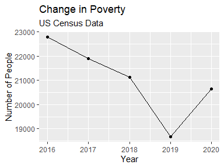

# COVID-19 ’s Impact on Adults Mental Health

### Introduction

With the recent COVID-19 pandemic, a lot of changes have been brought
into our lives. Which is why we wanted to evaluate the impacts of
COVID-19 on adult’s mental health. There are many ways that COVID-19 can
impact someone’s mental health:

-   finacial uncertainty

-   

To answer this question, we used datasets that focus on, SNAP,
MDE (major depressive episode), poverty, and reports of
symptoms of depressive disorders.  Our results may help us understand
the effects of COVID-19 on adults’ mental health in the United States.

### Methods

-   We compared the following aspects; finance/income (poverty/food
    insecurity) US adult’s lives before and after the pandemic to
    understand the impacts the pandemic had on mental health. 

-   This was collected by the us census

-   this is collected by the CDC through

-   We went to

-   How the data was collected before each data source

-   The analysis were done in R (R Core Team, 2021) and RStudio (RStudio
    Team, 2022). Using the following packages: tidyverse (Wickham,2019),

-   All data was collected by going to the corresponding website and
    downloading the to get the SNAP data, we went to the USDA website,
    searched for SNAP data tables, and downloaded. The poverty data, we
    went to the US census website, searched for the poverty tab, and
    downloaded the tables. To get the MDE data, we downloaded the raw
    data from the SAMHSA website, off of the national survey on mental
    health. The age MDE data came from KFF.org and this is a website
    that has data reporting nationwide health issues.

### Results

According to the SNAP data set, the national poverty level were on a
decrease from 2016 to 2019 (Fig. 1). Due to the financial uncertainties
brought on by the COVID-19 pandemic, there was a spike in cases of
poverty, and SNAP users in 2020. There were no cases of COVID-19 in the
US until January 2020. The amount of major depressive episodes has been
increasing from 2016-2020, but the biggest spike occurred the year the
pandemic started. The graph with how ages and MDE’s are correlated show
that the age group with the most MDE’s are 18-29. In fact, 49% of people
ages 18-29 said they had an MDE.

<!-- -->

Figure 1. The Number of SNAP users from 2016-2021 in the US

### Discussion

From the rise in MDE (major depressive episode); as well as the SNAP
users (Supplemental Nutrition Assistance Program) it is clear that there
is a correlation here. With the increase in SNAP users and an increase
in people in poverty from 2019 to 2020 you can understand why there is
an increase in major depressive episodes, especially with adults among
the ages of 18-29. This specific group of adults are more vulnerable to
because your early teens into your mid to late twenties are a very
uncertain time in one’s life.

As a group we came to the conclusion that, an increase in poverty levels
led to an increase in MDE for the age 18-29. Due to the level of
uncertainty that this group faces.

### References

R Core Team (2021). R: A language and environment for statistical
computing. R Foundation for Statistical Computing, Vienna, Austria. URL:
<https://www.R-project.org/>.

Wickham et al., (2019). Welcome to the tidyverse. Journal of Open Source
Software, 4(43), 1686, <https://doi.org/10.21105/joss.01686>.

RStudio Team (2022). RStudio: Integrated Development Environment for R.
RStudio, PBC, Boston, MA URL <http://www.rstudio.com/.>
